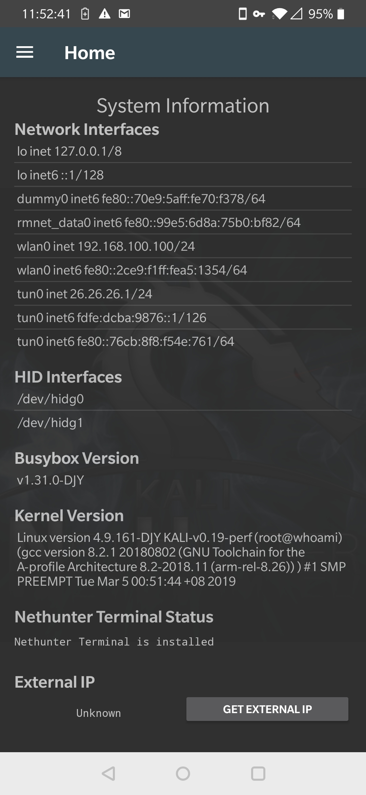

<div align=center></div>


# 前言

大家好我是来自中国的业余菜鸟极客打酱油。DJY Nethunter Kernel 是一个一加6和6T全功能的修补内核，支持hackrf，RTL-SDR，mousejack，osmcombb+C118+openbts，蓝牙攻击，外接红外模块，外接OTG网线进行pppoe路由器密码嗅探，OTG外接多种无线网卡RTX系列，MT7601系列，ahk9系列，htc系列。Proxmark3 CDC HID 驱动支持，chameleon-Mini驱动支持。这个项目是免费分享的，并不需要付费，谨防某些骗子团伙（某眼团队）拿来出售，请注意效验MD5值和hash值。为了编译这个内核我重复刷机上百次，解决刷入内核无法打开WIFI，无法使用adb shell，无法外接USB设备，黑屏，卡在第一屏等等错误....进行长时间的测试，如果有bug问题欢迎反馈。如果你觉得好用请给我一个**star** 你的支持是我最好的动力。

在这里我还要说一点，我免费分享给某些人用，你不但连句谢谢感激之类的话都没有（挡住某些人赚钱），你还要倒打一耙来骂我，贬低我，甚至还有些傻逼举报了我两个千人群聊，害我被封有意义吗？我在这里祝举报我的人生儿子没屁眼，喝水塞牙，每天都倒霉，还不起支付宝花呗，借呗，京东微贷，天天来大姨妈等等一系列倒霉事情。吃屎啦你！！！！！！

****

# 目录
* [Install](#Install)
* [更新历史](#更新历史)
* [内核图片和视频演示DJY11-13](#1、内核图片和视频演示DJY11-13)
* [DJY15](#2、DJY15_)
* [DJY17-DJY19](#3、DJY17-DJY19)
* [相关测试视频集合](#相关测试视频集合)
* [常见问题解决](#常见问题解决)
* [文件md5和hash](#文件md5和hash)
* [相关代码和模块感谢列表](#相关代码和模块感谢列表)

# Install

1、到 https://twrp.me/ 下载与你设备相关的twrp，然后到 https://www.oneplus.com/support/softwareupgrade/ 选择你的设备下载系统（这里需要注意的是，国内用户需要**翻墙**才能下载OOS，为什么这里不推荐使用一加的HOS系统呢？因为HOS国内系统在某些权限功能上面做了一些限制，所以会出现某些命令和终端不能正常使用的现象，但是也是可以用的，就是不够完美，这里推荐使用OOS）

2、使用我上传的payload_dumper win or linux 解压压缩包里面的payload.bin固件，然后刷入twrp，挂载所有分区，清理userdate分区，然后在选择清理所有分区，再使用我上传flash.sh or bat 刷入所有的镜像。这样就是全新的OOS了。

3、刷完之后，在刷入twrp，然后选择adb sideload 推送我的DJY Nethunter Kernel。
```
adb sideload DJY XXX.ZIP
```
4、然后重启到系统，国内用户重启的时候记得直接选择跳过，不要连WIFI或者拔掉SIM卡，因为你连了网他就会叫你登录谷歌，如果你路由器没有链接VPN的话会导致你卡死在谷歌登录页面。然后进入到了手机桌面环境，连接WIFI或4G，打开magisk app 进行更新（这里需要注意的是，如果你在第一次不打开magisk更新的话，会导致magisk SafetyNet 系统安全检查无法通过）然后重启。

5、打开magisk 选择模块，刷入我的WIFI固件包，现在你就可以完美使用nethunter的内核了。
```
正确操作流程：twrp>下载OOS>payload_dumper payload.bin>flash.sh or bat>adb sideload DJY XXX.zip>重启>第一次打开magisk进行联网更新来通过SafetyNet 状态检查>重启>刷入我的WIFI模块>开始装逼使用
```
6、关于刷入kalifs-full.tar.xz这里我推荐三种方法，第一第二种都是使用linux deploy来安装，第二种使用nethunter app安装。官方链接 https://build.nethunter.com/kalifs/kalifs-20190228/ 
第一种

第二种

第三种


```
这里需要注意的是如果你下载arm64，amd64，i386位版本的kalifs-full.tar.xz，你需要将包内文件名更改为armhf，如果不更改，那么nh终端和nethunter将无法识别和安装。内核已经内置了busybox1.31，所以不需要下载busybox安装器

```

# 更新历史

- [DJY0.1-DJY11] 修复众多BUG，添加HID attack支持，添加网卡支持，解锁手机内置AM/FM芯片不使用SDR即可接收AM/FM信号，CP210x，FTDI，CH341 模块.解锁蓝牙模块支持（蓝牙攻击），添加@simonpunk nethunter app usbarmy模块，添加修改@rithvikvibhu WIFI模块以便增加更多的支持并修复对9.0Pie系统的支持。测试系统OP6T_O2_BETA_04

- [DJY11-DJY13] 修复大量错误脚本错误，优化更新内核，更新nethunter app，添加内核补丁将selinux 永久设置为 permissive，更新WIFI固件错误脚本，更新busybox为1.31，修复busybox无法安装bug

- [DJY13-DJY15] 更新nethunterapp，更新nethunter-nh终端，添加更新app进WIFI固件包，删错WIFI固件刷机包多余代码，添加pn532模块，整体更新内核代码编译，修复HID攻击偶尔不能使用的情况。

（由于15以上加入了osmcombb和openbts自动环境脚本，已经触犯了国内相关法律，所以15以上版本内核不会公布）
- [DJY15-DJY17] 添加Proxmark3 CDC驱动，添加osmcombb一键环境配置脚本，一键刷机脚本。测试系统OP6T_O2_BETA_05

- [DJY17-DJY18] 添加pppoe USB外接驱动以增加嗅探路由器pppoe密码的功能，解锁手机NFC全功能，添加业余无线电台支持，整体优化更新内核。

- [DJY18-DJY19] 添加openbts+c118 一键伪基站配置脚本，加入GSM Sniff WEB GUI界面 ###完成进度百分之70#####


# 1、内核图片和视频演示DJY11-13
C118


HID Attack



BluetoothattackSupport


C118+osmcombb


mousejack


# 2、DJY15
C118+osmcombb 一键配置脚本


# 3、DJY17-DJY19

Proxmark3 CDC驱动支持


# 相关测试视频集合
- 蓝牙攻击
http://www.bilibili.com/video/av45974214/

- C118--P1
https://www.bilibili.com/video/av45973153

- C118--P2
https://www.bilibili.com/video/av45973153/?p=2

- chameleon-Mini
http://www.bilibili.com/video/av45943906/

- PM3
https://www.bilibili.com/video/av45941948

- PPPOE sniff
https://www.bilibili.com/video/av45942786

- pn532
http://www.bilibili.com/video/av45945899/

- wifte和fluxion不能使用修复
http://www.bilibili.com/video/av45974214/

- HID Aattack

https://www.bilibili.com/video/av43617250

- 无线网卡722N
https://www.bilibili.com/video/av45943180

* 欢迎提交各类测试截图和视频

# 常见问题解决
1、如果nethunter app 和 nh 终端使用异常请下载OOS。

2、如果magisk SafetyNet 状态检查不能正常执行请还原boot镜像在从新刷入magisk https://github.com/topjohnwu/Magisk/releases

3、如果无法在adb shell 或者安卓shell里面不能正常执行 bootkali 请重新刷入WIFI模块。

4、如果使用linux deploy 安装的 kali，如果无法启动postgesql请参考以下代码，mysql同理。

``` 
nano /usr/sbin/update-rc.d
# Blacklist
# postgresql disabled (comment)

#Whitelist
postgresql enabled (add)
-----
than you need to grand permisson of postgresql
usermod -a -G aid_inet postgres 
service postgresql start
exit
bootkali
```
5、如果WIFITE和fluxion不能正常使用参考 http://www.bilibili.com/video/av45974214/


# 文件md5和hash

```
b4c66efc7fc076121997083a95bf8f96  com.google.zxing.client.android-4.7.7-107-1042.apk
411fb7a7439ef1db0be9f76bebb5c1d4  com.sonelli.juicessh_116_apps.evozi.com.apk
70c26e550fc6bc0c1d76098d9dce43e4  linuxdeploy-2.2.1-243.apk
201f288e4a3a27638828a367e106c720  marto.rtl_tcp_andro_20_apps.evozi.com.apk
9b7b226a66c71179d93e291695f17c00  nethunter-app-Pie.apk
686332a10c18d0e926ce7a6b338c3ef0  RFAnalyzer.apk
3eacb5ae172f968f04ecb7ca79bb388e  shadowsocksr-release.apk
5d2b490bc25056029d17ebd474da4587  Term-nh.apk
6bd10e7ec862203e7fa1d3282c0d278d  USBKeyboard.apk
9517c8f6df5d8569e8bea9c41d29adea  WiFi.apk

4305f92439c517ca102e7546c2932d4d0b587cef  com.google.zxing.client.android-4.7.7-107-1042.apk
5c388a3fdec49df7b19f8353270b41f4d2826225  com.sonelli.juicessh_116_apps.evozi.com.apk
ef26fd6ffda89525e3f591dcda1b613aa0dcf8a5  linuxdeploy-2.2.1-243.apk
205146887061c62e1a3fcfe60efb4665f153525d  marto.rtl_tcp_andro_20_apps.evozi.com.apk
8989b8d2adec9030edd772eb2cfc691fb14b8f6a  nethunter-app-Pie.apk
1d48c025e18eef1a9c69252bf2cfa3464f2d34bf  RFAnalyzer.apk
0092d68ce07135d587d1d041550a65807bc939ea  shadowsocksr-release.apk

8a4ae41b5ed727767cec9607e58e3ea53e9155af  Term-nh.apk
cba3e89c8a3b3a43572d58f737bba53d928d4913  USBKeyboard.apk
2847a4acf3f6022f98e95d630c10c5bbf05bf136  WiFi.apk


a13cfb2dd89f8c4c34c7f74ba0032bb4  Wireless_Firmware_for_Nethunter-v4.0


93abfd9bec69180ff5a08e85f4488075ffd40d86  Wireless_Firmware_for_Nethunter-v4.0

79a75c5452327d151765bb698dc0e210  DJY Nethunter KernelV15.zip


5130697b30db4ec8e6a2c1f456aa80e0729d8988  DJY Nethunter KernelV15.zip


cdf3700352b8b08e99d34bda0dcf6271  busybox8（1.31）


9ce94e14952a6ecf444f67636e81b281cca5daf2  busybox8（1.31）

e09ea86bcb0eb8f30bc4bcc5703b2928  flash.bat
e09ea86bcb0eb8f30bc4bcc5703b2928  flash.sh
c1f55f501b5c628199ca3c0b200bd8d7  Payload_Dumber_x64 -win.zip
94ee67ddc8ae426beb3a6f8a8e361191  payload_dumper-linux.zip

9d315088a79a36ac08e29140bed21d1293205da1  flash.bat
9d315088a79a36ac08e29140bed21d1293205da1  flash.sh
542bd47de3e49848b7ba6ae4e07c7d07f45a40e7  Payload_Dumber_x64 -win.zip
7c97f484ce3c2b9174d107572f0e420b566643dc  payload_dumper-linux.zip


```
- 如果你发现MD5和hash对比不对，注意是否有人修改了并且植入了病毒


# 相关代码和模块感谢列表

感谢@simonpunk 对HID修补的大力支持。用到的相关构建代码链接：
https://github.com/simonpunk/nethunter-app

https://github.com/pelya/android-keyboard-gadget

感谢@HolyAngel 的优秀内核项目

https://gitlab.com/HolyAngel/op6

感谢@rithvikvibhu 感谢对Magisk WIFI模块做出的贡献


